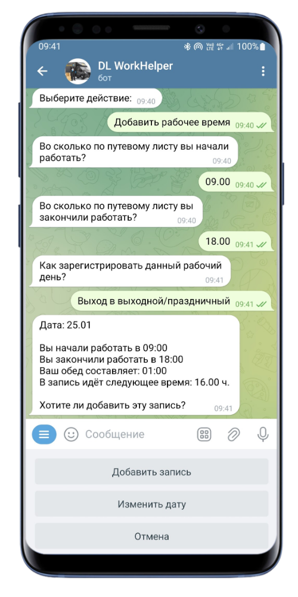
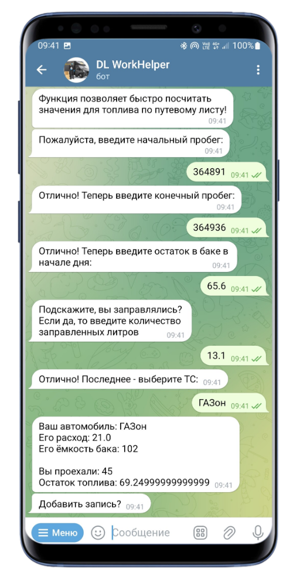
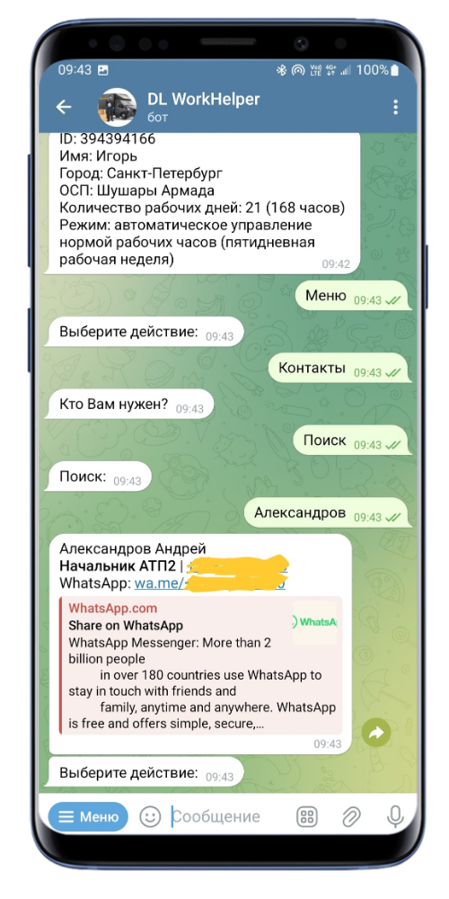
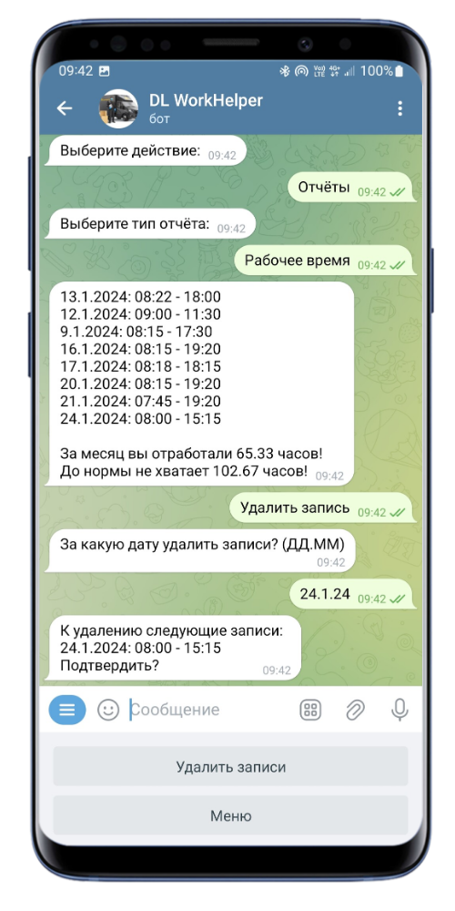
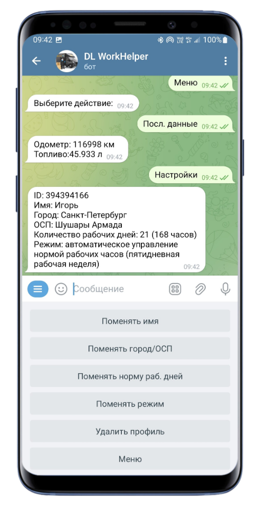

  
    
  

<h1>Описание проекта</h1>
Проект представляет собой чат-бота Telegram для облегчения и автоматизации ежедневных задач водителя-экспедитора МКТ ООО "ДЛ-Транс" 
Больше нет необходимости каждый день считать вручную параметры путевых листов и записывать в блокнот своё отработанное время

---
<h1>Возможности</h1>
<h3>Добавление рабочего времеин</h3>
<li>Пошаговый подсчёт засчитанного рабочего времени</li>
<li>Автоматическое ведение журнала учтённого рабочего времени</li>
<li>Учёт обеда</li>
<li>Учёт выхода в выходной праздничный день</li>
<h3>Добавление поездки</h3>
<li>Пошаговый подсчёт параметров путевого листа на основе начального и конечного пробега</li>
<li>Введение заправленного топлива</li>
<li>Выбор транспортного средства</li>
<li>Автоматическое ведение журнала поездок</li>
<li>Вывод параметров расхода топлива и объёма топливного бака для конкретного ТС автопарка</li>
<h3>Добавление оборота</h3>
<li>Пошаговое добавление оборота</li>
<h3>Контакты</h3>
<li>Вывод всех контактов в алфавитном порядке по должностям для конкретного города</li>
<li>Поиск по контактам</li>
<li>Вывод ссылки для быстрого набора номера</li>
<li>Вывод ссылки для открытия диалога в WhatsApp</li>
<h3>Отчёты</h3>
<li>Вывод журнала отработанного времени за месяц</li>
<li>Вывод журнала поездок за месяц</li>
<li>Вывод журнала оборота за месяц</li>
<li>Вывод любых журналов другого месяца в пределах календарного года</li>
<li>Выборочное удаление записей любого журнала в пределах календарного года</li>
<h3>Настройки</h3>
<li>Вывод id профиля Telegram (совпадает с логином для Android-приложения)</li>
<li>Изменение имени профиля</li>
<li>Изменение региональных настроек</li>
<li>Изменение режима работы</li>
<li>Изменение нормы часов в месяц</li>
<li>Удаление профиля</li>

---

<h1>Скриншоты работы</h1>

---

<h1>Инструкция по запуску проекта</h1>
<ol>
    <li>Заругистрируйте нового чат-бота Telegram, используя BotFather</li>
    <li>Склонируйте репозиторий git clone https://github.com/igor-526/DellinWT</li>
    <li>Создайте файл .env, добавьте в него следующие переменные:
        <ol>
            <li><b>HOST</b> - хост для подключения к БД (localhost)</li>
            <li><b>DB</b> - название для БД</li>
            <li><b>USER</b> - имя пользователя для БД</li>
            <li><b>PASSWORD</b> - пароль для пользователя БД</li>
            <li><b>PORT</b> - порт для запуска БД в сети Docker</li>
            <li><b>R_DB (0 | 1)</b> - сброс базы данных <b>(ОСТОРОЖНО! ИСПОЛЬЗОВАТЬ ТОЛЬКО ПРИ ПЕРВОМ ЗАПУСКЕ!)</b></li>
            <li><b>U_AUTO (0 | 1)</b> - обновить при запуске список ТС</li>
            <li><b>U_CONTACTS (0 | 1)</b> - обновить при запуске список контактов</li>
            <li><b>U_CITY (0 | 1)</b> - обновить при запуске список поддерживаемых городов</li>
            <li><b>U_BASES (0 | 1)</b> - обновить при запуске список поддерживаемых ОСП</li>
            <li><b>TOKEN</b> - токен бота Telegram, полученный с помощью BotFather</li>
        </ol>
    </li>
    <li>выполните docker compose up --build</li>
</ol>

---

<h1>В следующих версиях</h1>
<li>Подсчёт экономии и пережогов топлива при добавлении поездки</li>
<li>Настройка почасовой ставки водителя-экспедитора</li>
<li>Прогноз аванса и заработной платы водителя-экспедитора на основе введённых данных</li>
<li>Возможность вывода/удаления записей и получения статистики за предыдущие года</li>
<li>Поддержка всех ОСП Санкт-Петербурга и Москвы</li>
<li>Режим работы для водителей БТС</li>

---

<h1>Дополнения</h1>
В разработке находится Android приложение для GUI-взаимодействия с проектом
